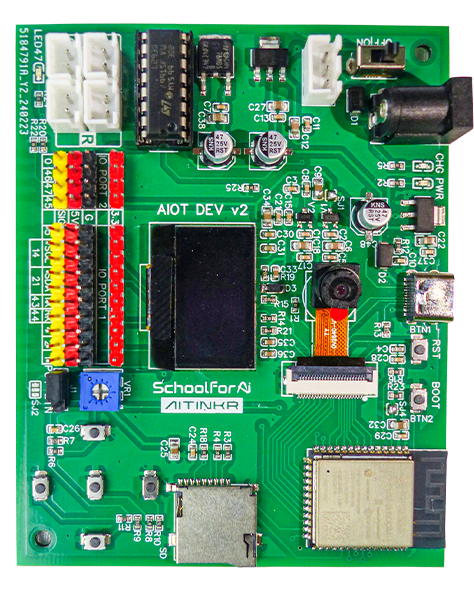

# AITinkr AIoT v2 Library for Arduino

The **AITinkr AIoT v2 Library** is designed to provide a seamless development experience with the **AITinkr AIoT Dev Board V2**. This library simplifies integration with the board's advanced features, enabling rapid development of IoT, robotics, and AI-based projects using the **Arduino IDE**.

---

## About AITinkr

**AITinkr** is a pioneer in creating innovative IoT and robotics solutions. Our mission is to empower learners, hobbyists, and professionals with intuitive tools and resources to bring their ideas to life.

- **Visit Us**: [AITinkr Platform](https://aitinkr.com/)
- **Explore Tutorials**: [AIOTLab Portal](https://aiotlab.aitinkr.com/)

---

## About AITinkr AIoT Dev Board V2

The **AITinkr AIoT Dev Board V2** is a powerful platform based on the **ESP32-S3** microcontroller. With its dual-core 32-bit processing, high-speed memory, and integrated peripherals, the board is ideal for creating IoT devices, robots, and AI-driven systems.

For the full hardware manual, visit: [AITinkr AIoT Dev Board Manual](https://aiotlab.aitinkr.com/#/doc)

### Key Features

- **Processor**: Dual-core 32-bit ESP32-S3 with 4 MB Flash and 2 MB PSRAM

- **Connectivity**:

  - Wi-Fi (802.11 b/g/n-compliant)
  - Bluetooth 5.0 (BLE + mesh)

- **Integrated Components**:

  - Built-in SD card socket for expandable storage
  - Onboard potentiometer (shared with GPIO, selectable via jumper)
  - 5 tactile buttons for user interaction
  - OV2640 2 MP camera connector for vision-based applications
  - 2-channel motor driver with JST connectors

- **Power and Interfaces**:

  - **AITinkr Standard 3-pin JST Connector** for AITinkr 7.4V Li-ion batteries with in-built BMS
  - 7-12V DC input via DC Jack
  - USB Type-C for power and data connectivity
  - Power switch for convenient control

- **Peripherals**:

  - 0.96-inch OLED display (SSD1306 driver)
  - OV2640 2 MP camera for vision applications
  - 2-channel motor driver with JST connectors
  - Programmable GPIOs with PWM support
  - Analog interfaces: 4 x 12-bit ADC or Touch Sensing IOs

- **Power**:

  - **AITinkr Standard 3-pin JST Connector** for AITinkr 7.4V Li-ion batteries with in-built BMS
  - 7-12V DC input via DC Jack
  - USB Type-C for power and data connectivity

### Supported Features for ESP32-S3 Pins

- **GPIO**: Up to 12 programmable GPIO pins for external interface, with dedicated power rails for 3.3V and 5V.

- **Dedicated Servo Pins**: 4 dedicated pins with an independent 5V regulator for servo motor control.

- **PWM**: All GPIO pins support PWM for motors, servos, and LEDs.

- **ADC**: 4 x 12-bit ADC channels for analog input.

- **Touch Sensing**: 4 channels for capacitive touch sensing.

- **I2C**: 2 I2C buses for communication with peripherals.

- **SPI**: Fully configurable SPI pins for high-speed communication.

- **UART**: Multiple UART channels for serial communication.

- **I2S**: Support for audio data processing.

- **SD/MMC**: Interface for SD card integration.

---

## AITinkr AIoT v2 Library Features

The **AITinkr AIoT v2 Library** provides an easy-to-use interface to unlock the full potential of the **AITinkr AIoT Dev Board V2**:

1. **GPIO Control**: Intuitive APIs for digital input/output.

2. **PWM Support**: Control servos, LEDs, and motors with precision.

3. **I2C Communication**: Simplified setup and scanning for I2C peripherals.

4. **Motor Driver Control**: Directional and speed control for dual motors.

5. **OLED Display**: Integrated SSD1306 support for real-time feedback.

6. **Camera Integration**: Capture images and process vision data using the OV2640.

7. **Battery Monitoring**: APIs to monitor battery power and status.

8. **Potentiometer and Keyboard Support**: Jumper-selectable functionality on shared pins.

---

## Installing the AITinkr AIoT v2 Library

### Step 1: Open the Library Manager

1. In the Arduino IDE, go to `Tools > Manage Libraries`.

### Step 2: Search for the Library

1. Type **"AITinkr AIoT v2 Library"** in the search bar.
2. Click **Install** next to the library.

Once installed, you're ready to explore the library's features.

---

## Examples

The library comes with examples to get you started:

1. **Blink an LED**: Toggle an external LED using GPIO pins.
2. **Motor Control**: Control dual motors with speed and direction adjustments.
3. **I2C Device Scan**: Discover connected I2C peripherals.
4. **Wi-Fi Connectivity**: Connect to a Wi-Fi network and exchange data.
5. **Capture Images**: Use the onboard OV2640 camera to capture photos.

To load an example:

1. Open Arduino IDE.
2. Go to `File > Examples > AITinkr_AIOT_Library`.
3. Select an example and upload it to your board.

---

## Learn More

- **AITinkr Platform**: [https://aitinkr.com/](https://aitinkr.com/)
- **AIOTLab Portal**: [https://aiotlab.aitinkr.com/](https://aiotlab.aitinkr.com/)

For tutorials, troubleshooting tips, and advanced projects, explore the resources provided on these platforms.

---

